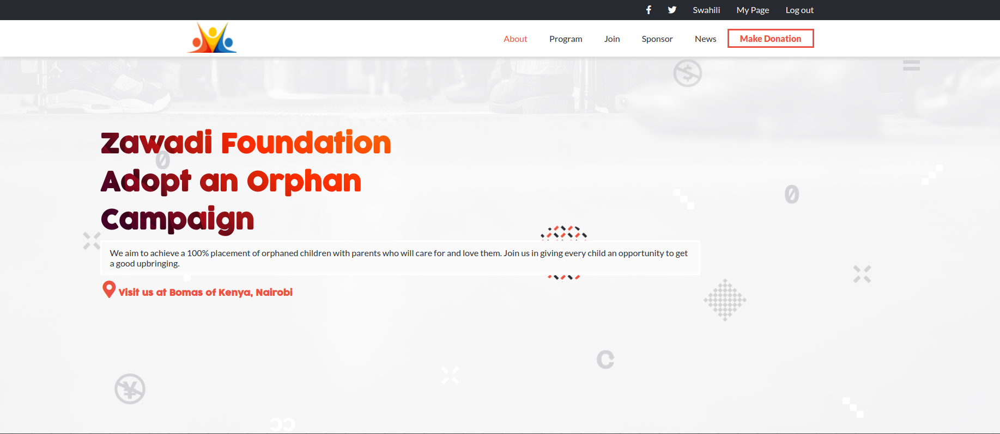

# Adopt an Orphan

> This is an Orphanage website that creates awareness on adoption & caring for orphaned children 




## Built With

- HTML
- CSS
- JavaScript


## Live Demo

[Live Demo Link](https://felix45.github.io/adopt-an-orphan/)


## Getting Started

To get a local copy up and running follow these simple example steps.

### Prerequisites
```
  node js
  npm

```
### Setup
Clone the repository and change the directory to portfolio

``` 
  $ git clone git@github.com:Felix45/adopt-an-orphan.git

  $ cd adopt-an-orphan

```

### Install
Install all project dependencies by running the command below
 
``` 
  $ npm install
```
### Usage
Start the http application server
``` 
  $ http-server
```

### Deployment
- [Visit Application Homepage](http://localhost:8080)


### Authors

| 👤 Name | Github | Twitter | LinkedIn |
|------|--------|---------|----------|
|Felix Ouma|[@Felix45](https://github.com/Felix45)|[@Felix_Atonoh](https://twitter.com/Felix_Atonoh)|[LinkedIn](https://www.linkedin.com/in/felix-ouma-639766b0/)|


## 🤝 Contributing

Contributions, issues, and feature requests are welcome!

Feel free to check the [issues page](https://github.com/Felix45/adopt-an-orphan/issues).

## Show your support

Give a ⭐️ if you like this project!

## Acknowledgments

- Hat tip to [Microverse](https://bit.ly/MicroverseTN) for giving me this project to work on and [Cindy Shin](https://www.behance.net/adagio07), for using her design.
- Hat tip to [Pexels](https://www.pexels.com/collections/side-profiles-d1j9mjy/) free stock photos and [SVG Repo](https://www.svgrepo.com) for the svg icons used in this design.

## 📝 License

This project is [MIT](https://github.com/git/git-scm.com/blob/main/MIT-LICENSE.txt) licensed.
